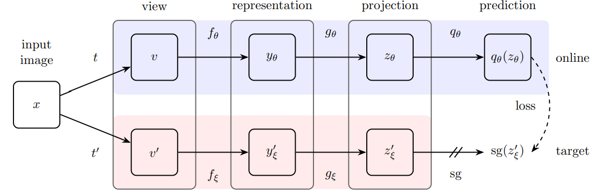

# PyFlow_SimCLR: 
##### Author: Talip Ucar (ucabtuc@gmail.com)

Pytorch implementation of BYOL (https://arxiv.org/pdf/2006.07733v1.pdf) with custom Encoder.



<sup>Source: https://arxiv.org/pdf/2006.07733v1.pdf </sub>
# Model
Model consists of two networks; Online and Target networks. Target network can be considered as moving average of 
Online network. So, the parameters of Target network is updated using the parameters of Online network.

Each network is initialized with a "EncodeProject()" class. 
<pre>
EncoderProject consists of two networks: 
      -Encoder to learn representation
      -Projection to project representation

Thus,
    z = EncodeProject(x)  &#x27FA;  z = Project(Encode(x))    
</pre>

A Prediction network uses output of Online network to predict the output of Target network. In the process, Encoder learns
useful representations of the data. High-level training looks like following:

<pre>
xi = Transform(x)
xj = Transform(x)

Online Network
    zi = EncodeProject(xi)  
    qi = Predictor(zi)
    
Target Network 
    zj = EncodeProject(xj)  

Training Objective:
    qi &#x2975; zj
</pre>

**Note:** To make training symmetric (meaning all networks see both xi, and xj), both (xi, xj) and (xj, xi) are fed to the networks.


For Encoder, Resnet18, or Resnet50 can be used (yet to be implemented). A custom CNN-based encoder model is also provided as a feault option, and its architecture is defined in 
yaml file of the model ("./config/byol.yaml"). 

Example: 
<pre>
conv_dims:                        
  - [  3,  32, 5, 2, 1, 1]      # [i, o, k, s, p, d]
  - [32,  128, 5, 2, 1, 1]      # i=input channel, o=output channel, k = kernel, s = stride, p = padding, d = dilation
  - [128, 512, 5, 2, 1, 1]      
  - 512 
</pre>

```conv_dims``` defines first 3 convolutional layer as well as input dimension of the projection head. You can change this architecture
by modifying it in yaml file. You can add more layers, or change the dimensions of existing ones. 
Architecture is agnostic to input image size.

Resnet18 and Resnet50 models will be supported in the future.

# Datasets
Following datasets are supported:
1. STL10    (Image size=96)
2. CIFAR10  (Image size=32)
3. MNIST    (Image size=28)

For example, the encoder can be trained on STL10, and evaluated on both STL10 and CIFAR10.

# Environment - Installation
It requires Python 3.8. You can set up the environment by following three steps:
1. Install pipenv using pip
2. Activate virtual environment
3. Install required packages 

Run following commands in order to set up the environment:
```
pip install pipenv               # If it is not installed yet
pipenv shell                     # Activate virtual environment
pipenv install --skip-lock       # Install required packages. --skip-lock is optional, 
                                 # and used to skip generating Pipfile.lock file
```

# Training
You can train the model using any supported dataset. For now, STL10 is recommended to use for training. The more datasets will be 
supported in the future.

# Evaluation
## Evaluation of trained SSL representations
1. Logistic regression model is trained, using representations extracted from Encoder using training set of
specified dataset.
2. The results are  reported on both training and test sets.

## Baseline Evaluation
1. Raw images of specified dataset is reshaped to a 2D array. 
2. PCA is used to reduce the dimensionality so that the feature
dimension is same as that of representations from Encoder (to be a fair comparison). 
3. Logistic regression model is trained, using data obtained using PCA, the results are reported on both training and
test sets.

# Results

Results at the end of training is saved under "./results" directory. Results directory structure:

<pre>
results
    |-evaluation 
    |-training 
         |-model
         |-plots
         |-loss
</pre>

You can save results of evaluations under "evaluation" folder. At the moment, the results of 
evaluation is also printed out on the display, and not saved.

# Running scripts
## Training
To pre-train the model using STL10 dataset, you can use following command:
```
python 0_train_encoder.py -d "STL10" -img 96
```
## Evaluation
Once you have a trained model, you can evaluate the model performance on any dataset. Correct image size should be provided
with corresponding dataset to get correct results since the model architecture is agnostic to image size and will not flag
error if correct image size is not specified.

Two examples: 
1. Evaluating on STL10
```
python 1_eval_linear_classifier.py -d "STL10" -img 96
```
2. Evaluating on CIFAR10
```
python 1_eval_linear_classifier.py -d "CIFAR10" -img 32
```

For further details on what arguments you can use (or to add your own arguments), you can check out "/utils/arguments.py"

# Experiment tracking
MLFlow is used to track experiments. It is turned off by default, but can be turned on by changing option in 
runtime config file in "./config/runtime.yaml"